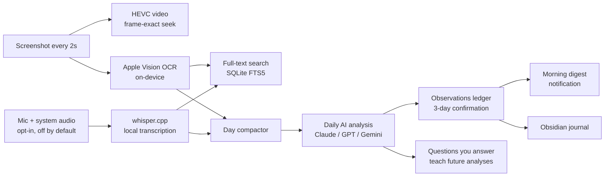

# Kaze

**Your Mac remembers everything you do — and tells you how to work smarter.**

Kaze is a native macOS menu-bar app that continuously records your screen into a compressed, searchable timeline, then runs a once-daily AI analysis that spots repeated low-value behaviors — polling loops, menu-mousing, copy-paste rituals, tool costs — and suggests concrete automations for them. Patterns are confirmed over multiple days before they're surfaced, so suggestions are grounded in how you actually work.

Open-source (GPL-3.0) alternative to [rewind.ai](https://rewind.ai). Continuation of OpenRewind (forked from [OpenRecall](https://github.com/openrecall/openrecall)); "Kaze" is 風, Japanese for wind. 100% native Swift/SwiftUI — no Electron — and recording stays entirely on your Mac.

## How it works



## Features

### Recording

- Screenshot of the primary display every 2 seconds (ScreenCaptureKit); Kaze's own windows are excluded from capture
- Frames are batched into HEVC video via hardware encoding (AVAssetWriter/VideoToolbox — no ffmpeg), typically a few MB per hour; screenshot N maps exactly to video frame N for pixel-perfect seeking
- Resolution changes (display switches) are handled cleanly; pending frames are flushed on stop and quit so nothing is lost
- Optional audio recording — **off by default**: microphone + system audio mixed locally into 30s chunks, transcribed on-device by whisper.cpp (CoreML-accelerated, automatic language detection)
- CPU-aware scheduler defers heavy work (encoding) when the system is above 75% load; interrupted tasks recover automatically after a crash
- 14-day automatic retention; recording toggles persist across launches

### Search and timeline

- Every frame is OCR'd on-device with Apple Vision (free, private) — everything you have seen becomes searchable text
- Full-text search (SQLite FTS5) across screen text and audio transcripts, with highlighted snippets; jump from a result to that exact moment
- **Rewind window**: full-screen scrubable timeline — trackpad/scroll-wheel scrubbing, arrow keys (Shift for x10), `Cmd+F` or `/` to search, `t` for the live transcript panel, snap-to-now on focus
- **Library window**: storage overview, video/audio file management, transcription browser with copy/delete, live pipeline status (encoding, transcribing, queues)

### Daily AI analysis

- The day compactor collapses tens of thousands of frames into a few hundred activity segments (a full workday is roughly 50k tokens — about $0.05–0.30 per day depending on model)
- **Bring your own provider**: Anthropic (Claude), OpenAI (GPT), or Google (Gemini) — keys stored per-provider in the macOS Keychain, model IDs editable, switch anytime; all three use structured JSON output
- Repeated low-value behaviors go into an **observations ledger**; a pattern seen on 3 distinct days is confirmed and surfaces as a concrete suggestion (hotkey, script, browser extension, cheaper tool)
- Morning digest at 7:00 with a macOS notification — plus run-on-demand from the menu bar
- **Vision sampling**: screens where real time was spent but OCR read little (design tools, video, image-heavy work) are sent as downscaled screenshots — up to 12 per day — so visual work is understood too
- **It asks when it can't tell**: activity that neither OCR nor vision can identify becomes a question in the Insights window (with a frame thumbnail). Your one-line answers persist and feed every future analysis — Kaze gets smarter about your work within days
- **Insights window**: digests, suggested optimizations (dismissible), patterns being watched, open questions, and a dry-run mode that previews the exact prompt and token cost without calling any API

### Obsidian journal

- One-way export into any vault (vaults auto-detected; a vault is just Markdown, so no plugin needed)
- A daily digest note per day, tagged and frontmatter-ready, with a seeded "My notes" section — everything you write below the marker survives re-export
- `Kaze Improvements.md`: an append-only checklist of confirmed suggestions — tick a box when you adopt one and it becomes your running record of time won back
- "Export existing history" backfill; if your vault syncs, your improvement journal follows you across machines

### Privacy

- Recordings, OCR text, and transcripts never leave your Mac; analysis is opt-in and only sends the compacted text timeline plus at most 12 downscaled frames, once a day, to the provider you chose
- API keys live in the macOS Keychain; audio capture is off unless you enable it; anything can be deleted from the Library; everything expires after 14 days

## Quick start

Apple Silicon Mac, macOS 15+, Command Line Tools only (no Xcode required):

```sh
cd macos
./setup-signing.sh   # once: stable local signing so permissions survive rebuilds
./build-app.sh
open dist/Kaze.app
```

Then:

1. Grant **Screen Recording** in System Settings (Kaze will prompt); optionally Microphone if you enable audio
2. Menu bar → **Settings → AI Analysis** → pick a provider and paste an API key
3. Optionally **Settings → Journal** → choose your Obsidian vault
4. Let it record for a few days — digests, suggestions, and questions start flowing

Full architecture, configuration, and development notes: [macos/README.md](macos/README.md).

## Configuration

| Setting | Where | Default |
|---|---|---|
| AI provider + model | Settings → AI Analysis | Claude `claude-opus-4-8` / GPT `gpt-4o` / Gemini `gemini-2.0-flash` |
| Digest hour | `K.analysisHour` | 07:00 |
| Screen recording | Menu bar / Settings | on |
| Audio recording | Menu bar / Settings | **off** |
| Journal folder | Settings → Journal | off until a vault is chosen |
| Capture interval / retention | `Constants.swift` | 2s / 14 days |

Headless hooks for cron and testing (`KAZE_ANALYZE_DRYRUN`, `KAZE_ANALYZE_RUN`, `KAZE_JOURNAL_EXPORT`, self-tests) are documented in [macos/README.md](macos/README.md).

## Repository layout

- `macos/` — the native Swift app (active development)
- `src/`, `pages/`, `components/` — the original Electron implementation (legacy reference; same SQLite schema and data directory, so data carries over)
- `bin/darwin-arm64/` — bundled whisper.cpp binary and model

## Roadmap

- Cloud sync of the analysis ledger and digests (not raw recordings) for cross-machine history
- Weekly rollups and richer vision sampling

## License

GPL-3.0. Based on OpenRewind by alikia2x, itself forked from OpenRecall.
